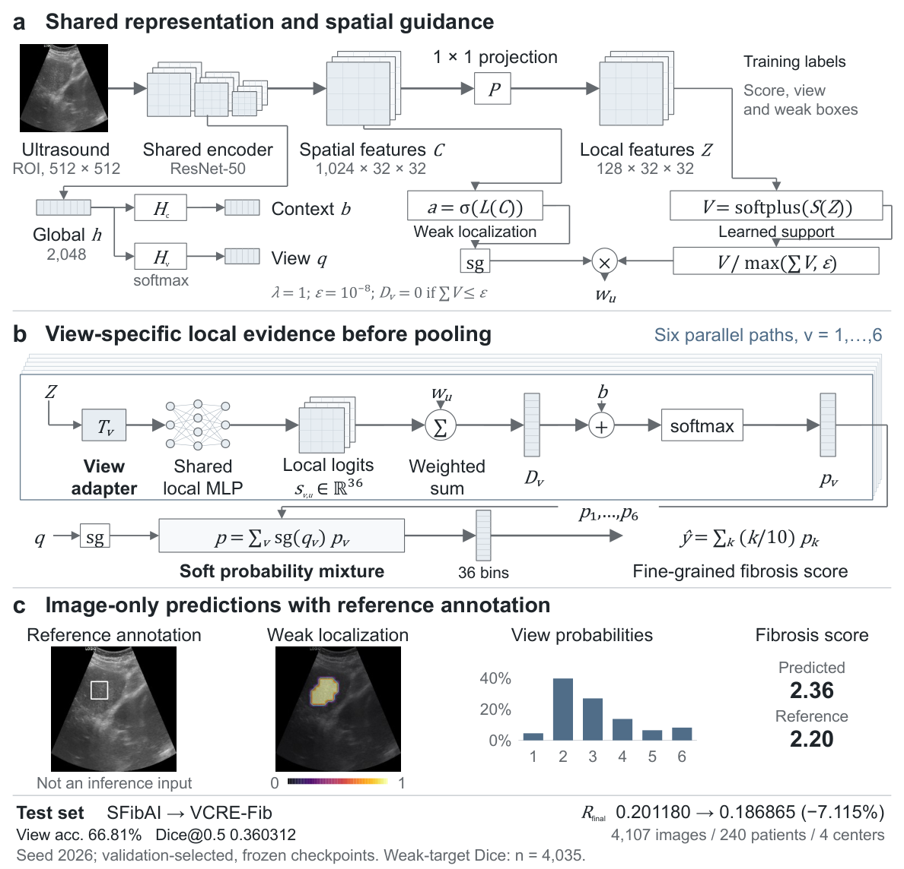

# VCRE-Fib 中文说明

[English README](README.md) 是默认入口。仓库文档、Issue、Pull Request、提交信息和新增代码注释默认使用英文。

[](paper/figures/assets/fig01_architecture.pdf)

仓库提供模型、数据处理、训练、评估、消融和可视化代码，以及主图的 PDF、PNG 和可编辑 PPTX。原创代码采用 [Apache-2.0](LICENSE)，第三方代码保留原许可证。

临床数据、标注、患者及图像清单、逐图预测、权重、原始日志、论文正文和结果表暂不公开。

```bash
git clone https://github.com/StatXzy7/vcre-fib.git
cd vcre-fib
python -m pip install -e '.[test]'
python -m pytest -q
python tools/check_release.py
```

使用 Python 3.10 或更高版本。正式训练与评估需要 Linux 和 CUDA。安装、私有输入格式和运行命令见 [使用指南](docs/REPRODUCING.md)。

区域模型与历史交付源码是不同实现，其源码和结果对应关系仍需核清，详见 [来源说明](docs/PROVENANCE.md)。软件测试通过不代表实验数值已复现。

后续公开修改直接维护本仓库；私有输入与实验输出存放在仓库外。发布步骤见 [贡献指南](CONTRIBUTING.md)。
